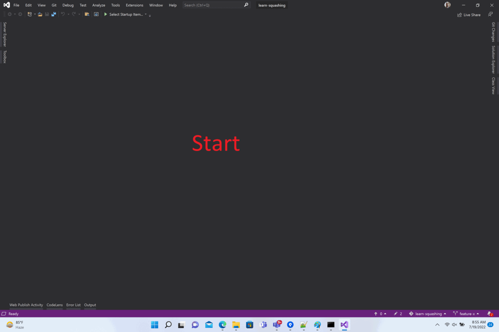

# Squashing in Git

## Introduction
- Squashing in git is making multiple commits as one
- Squashing helps in cherry picking
- Squashing helps in creating patches
- Squashing helps in rebasing

## How to squash commits

### Visual studio
- Clone the repo using the command `git clone https://github.com/GetGitReady/learn-squashing.git`
- Open the repo in Visual studio

- Check out branch `feature-x`

- Squash commits of `feature-x`

### Source Tree
- Clone the repo using the command `git clone https://github.com/GetGitReady/learn-squashing.git`
- Open the repo in Source Tree

- Check out branch `feature-x`

- Squash commits of `feature-x`

